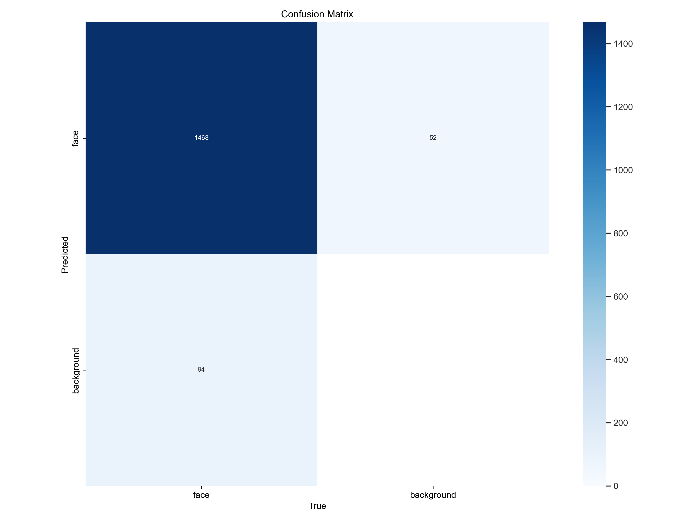
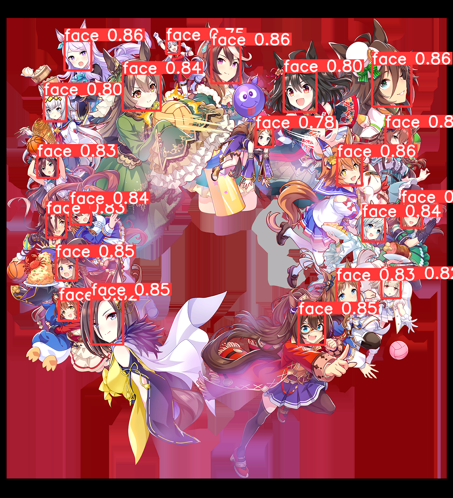

# yolov8_animeface
Anime Face Detection using YOLOv8

## Dataset
Dataset was made of 10 000 images manually annotated from safebooru. Split was train 70, val 20, test 10.

## Usage
One model is provided in the release page. Requirements are provided in the requirements.txt file.

All notebooks are provided to train, evaluate, and predict with the model. They're shipped with comments and notes to understand better yolov8's results.

To use the model, simply use

```python
from ultralytics import YOLO

yolov8_animeface = YOLO('yolov8_animeface.pt')
yolov8_animeface.predict('./images/', save=True, conf=0.3, iou=0.5)
```

Tweak conf and iou as you want.

## Performance

This model is based on yolov8x6. It has been trained on the said dataset for 300 epoch at 1280px*1280px. It took ~110 hours to train on a RTX A4000.

On my dataset, the model performs particularly well with the default parameters.

```
Images  Instances    Box(P        R      mAP50     mAP50-95):
1002       1562      0.957      0.924      0.955      0.534
Speed: 1.3ms preprocess, 81.9ms inference, 0.0ms loss, 0.8ms postprocess per image
```

While it doesn't provide a huge mAP50-95, its predictions are always correct on the files I've tested. Confidence could be higher, but the model is very precise.


*Confusion matrix of the model, generated on the test set*


*PR curve of the model, generated on the test set*

Other metrics are available in the `./demo/val` subfolder.

## Demo

Manual annotation             |  yolov8_animeface
:-------------------------:|:-------------------------:
  |  
  |  


## Comparison with an existing model

While we can argue about the comparison between two models from different generations, I believe it is interesting to compare this model with [zymk9's model based on yolov5](https://github.com/zymk9/yolov5_anime) because they have the same purpose.

On the same dataset with the same parameters (conf=0.001 & iou=0.6), yolov8x6-animeface produces better metrics than the one on yolov5x.

yolov8-animeface:
```
Images  Instances    Box(P        R      mAP50     mAP50-95):
1002       1562      0.956      0.919      0.953      0.532
Speed: 1.2ms preprocess, 81.2ms inference, 0.0ms loss, 1.0ms postprocess per image
```

yolov5-anime:

```
Images  Instances    Box(P        R      mAP50     mAP50-95):
1003       1566      0.778      0.685      0.633      0.232
Speed: 1.5ms pre-process, 85.5ms inference, 1.4ms NMS per image at shape (32, 3, 1280, 1280)
```

yolov5-anime provides better results when images are resized at 640px, but it still is inferior to yolov8-animeface with the same parameters.
Surprisingly enough, yolov5 is way more confident that yolov8. However, it also has way more false positives.


Yolov8_animeface             |  Yolov5_anime
:-------------------------:|:-------------------------:
  |  
  |  


## Conclusion

While this model performs greatly on my dataset, my metrics can differ from yours. One lighter model might be released on a later occasion.

Based on YOLOv8 by
Jocher, G., Chaurasia, A., & Qiu, J. (2023). Ultralytics YOLO (Version 8.0.0) [Computer software]. https://github.com/ultralytics/ultralytics
